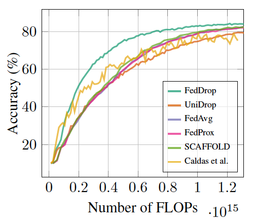

# FedDrop: Trajectory-weighted Dropout for Efficient Federated Learning

This repo contains the official PyTorch code
of **FedDrop** and instructions for reproducing results
reported in the paper.

# Installation

## Requirements

* python >= 3.7 with pip.
* pipenv: See
  [here](https://pipenv-fork.readthedocs.io/en/latest/)
  for instruction.
  * Usually you can simply run `pip install --user pipenv`.

## Setting up FedDrop

```bash
$ pipenv install # install dependencies from Pipfile
$ pipenv shell # activate virtual environment
```

# Running FedDrop

## Data Preparation

The default root path of CIFAR-10, Fashion-MNIST and SVHN datasets
is `federated/data/` folder.
The default dataset folder can be configured with `--data-dir=...`.
The datasets can be downloaded automatically by torchvision
in the first run,
and we use the standard train/test splits.

## Training

Run `./f -h` to see the help information for all arguments.

For example,
to evaluate **FedDrop**
on non-IID CIFAR-10 dataset splits with 20 clients,
we can use:
```bash
./f accel cifar10 vgg9 \
  --split-mode=dirichlet --split-alpha=0.5 --data-dir='./data' \
  --num-clients=20 --train-fraction=1 \
  --learning-rate=0.02 --batch-size=4 --epochs-per-round=4 \
  --max-rounds=100 \
  --accel-mode=threshold --accel-flops-global=0.5 \
  --accel-iterations=10000 --accel-regularizer=0.001 \
  --num-gpus=4 --num-processes=20 --run-name='accel'
```

To evaluate [**FedAvg**](http://proceedings.mlr.press/v54/mcmahan17a/mcmahan17a.pdf),
```bash
./f sync cifar10 vgg9 \
  --split-mode=dirichlet --split-alpha=0.5 --data-dir='./data' \
  --num-clients=20 --train-fraction=1 \
  --learning-rate=0.02 --batch-size=4 --epochs-per-round=4 \
  --max-rounds=100 \
  --num-gpus=4 --num-processes=20 --run-name='fedavg'
```

To evaluate [**FedProx**](https://arxiv.org/abs/1812.06127),
```bash
./f sync cifar10 vgg9 \
  --split-mode=dirichlet --split-alpha=0.5 --data-dir='./data' \
  --num-clients=20 --train-fraction=1 \
  --learning-rate=0.02 --batch-size=4 --epochs-per-round=4 \
  --max-rounds=100 \
  --num-gpus=4 --num-processes=20 --fedprox-mu=0.01 --run-name='fedprox'
```
The FedProx regularizer $\mu$ can be tuned with `--fedprox-mu`.

To evaluate **UniDrop**,
```bash
./f accel cifar10 vgg9 \
  --split-mode=dirichlet --split-alpha=0.5 --data-dir='./data' \
  --num-clients=20 --train-fraction=1 \
  --learning-rate=0.02 --batch-size=4 --epochs-per-round=4 \
  --max-rounds=100 --accel-mode=random \
  --num-gpus=4 --num-processes=20 --run-name='unidrop'
```

To evaluate [**Calda et al.**](https://arxiv.org/abs/1812.07210),
```bash
./f accel cifar10 vgg9 \
  --split-mode=dirichlet --split-alpha=0.5 --data-dir='./data' \
  --num-clients=20 --train-fraction=1 \
  --learning-rate=0.02 --batch-size=4 --epochs-per-round=4 \
  --max-rounds=100 --accel-mode=caldas \
  --num-gpus=4 --num-processes=20 --run-name='caldas'
```

To evaludate [**SCAFFOLD**](https://arxiv.org/abs/1910.06378),
```bash
./f scaffold cifar10 vgg9 \
  --split-mode=dirichlet --split-alpha=0.5 --data-dir='./data' \
  --num-clients=20 --train-fraction=1 \
  --learning-rate=0.02 --batch-size=4 --epochs-per-round=4 \
  --max-rounds=100 \
  --num-gpus=4 --num-processes=20 -fpmu=0.01 --run-name='scaffold'
```

# Results

Example FLOPs-Accuracy plot for above experiments (20 clients):

